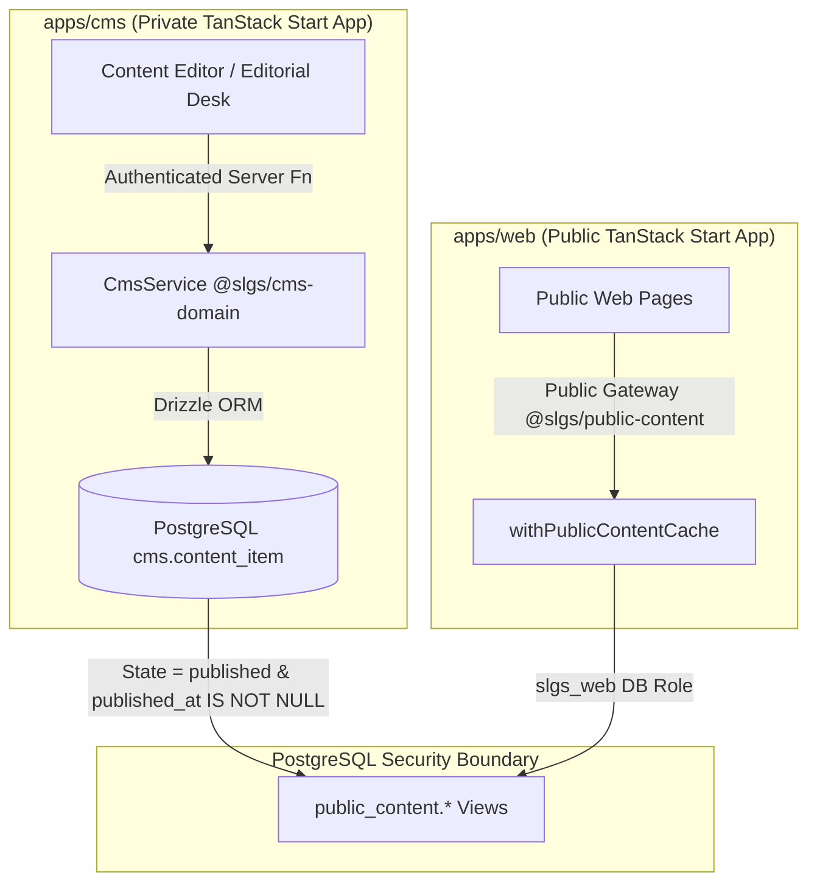
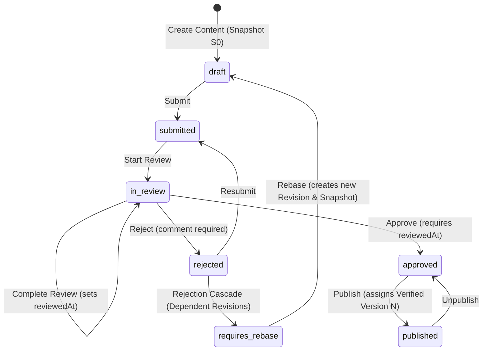

# Content Lifecycle and Canonical Path Architecture

Status: **ACTIVE — APPROVED SPECIFICATION AND IMPLEMENTATION**

This document specifies the end-to-end editorial lifecycle, state transitions, security boundary, public web visibility, and canonical path architecture of the Sierra Leone Grammar School (SLGS) Digital Platform.

---

## Architecture Overview

The platform monorepo cleanly separates administration from public consumption:



- **`apps/cms`**: Authenticated editorial interface using `@slgs/cms-domain` domain services. Requires authoritative session and phase authorization grants.
- **`cms.content_item`**: Relational single source of truth for content, state, author, reviewer, approver, publisher, revisions, and canonical path.
- **`public_content.*` Views**: Security-barrier views (`page`, `article`, `event`, `announcement`, `gallery`) projecting **only** published content with a non-null publication timestamp.
- **`apps/web`**: Public anonymous web application. Connects using the restricted `slgs_web` database role which has `SELECT` privileges exclusively on `public_content.*` views.

---

## State Transition Workflow

Content items move through an audited, ordered state machine based on the **single base snapshot + `requires_rebase`** model:



### Transition & Permission Matrix

| Transition | From State | To State | Required Permissions | Mandatory Conditions |
|---|---|---|---|---|
| **Submit** | `draft`, `rejected` | `submitted` | `*:submit:own` or `content:submit:cms` | Author or authorized submission role; progression blocked if unresolved predecessor exists |
| **Start Review** | `submitted` | `in_review` | `content:review:assigned` or `content:review:cms` | **Independent actor** (`authorUserId !== actor.userId`) |
| **Complete Review** | `in_review` | `in_review` | `content:review:assigned` or `content:review:cms` | Sets `reviewedAt` and `reviewedBy`, comment required |
| **Reject** | `in_review` | `rejected` | `content:reject:assigned` or `content:reject:cms` | Return comment required; cascades uncompleted dependent revisions to `requires_rebase` |
| **Approve** | `in_review` | `approved` | `content:approve:assigned` or `content:approve:cms` | **Independent actor**, `reviewedAt` must be non-null |
| **Publish** | `approved` | `published` | `content:publish:approved` or `content:publish:cms` | Sets `publishedAt` timestamp and `publishedBy`; assigns incremental `verifiedVersionNumber` (e.g., Verified Version 1, 2) |
| **Unpublish** | `published` | `approved` | `content:unpublish:published` or `content:unpublish:cms` | Clears public view projection immediately |
| **Rebase** | `requires_rebase` | `draft` | `*:update:own` or `content:update:cms` | Creates a NEW revision (e.g., 1.6) with new `snapshotId`, target `baseSnapshotId`, and `rebasedFromSnapshotId`, leaving old snapshot in `requires_rebase` |

---

## Content Revision, Snapshot, and Editorial Rules

1. **Single Base Snapshot & Immutable Revision Model**:
   - Every content revision possesses: a unique revision number (e.g. `1.3`, `1.4`), an immutable snapshot (`snapshot_id`), a single `base_snapshot_id` identifying the target snapshot against which it was created, and a workflow status.
   - History is strictly additive: updating, rejecting, or rebasing content creates or updates revision records without deleting historical snapshots.

2. **Unresolved Predecessor Progression Blocking**:
   - The system tracks dependencies via `base_snapshot_id`. A revision cannot progress to review, approval, or publication if an earlier unresolved revision sharing the same `base_snapshot_id` or on the same line exists.

3. **Rejection Cascade & `requires_rebase` State**:
   - If a revision (e.g., snapshot `S1`) is rejected, all uncompleted downstream revisions created against `S1` as their `base_snapshot_id` are automatically set to `requires_rebase`.
   - The original rejected snapshot (`S1`) and its revision remain preserved in history for auditability.

4. **Immutable Rebase Flow**:
   - When rebasing a content item in `requires_rebase`, the user selects a valid base snapshot (e.g. latest published snapshot `S0`).
   - The system creates a NEW revision (e.g., Revision `1.6`) with a new `snapshot_id` (`S3`), `base_snapshot_id` (`S0`), and `rebased_from_snapshot_id` (`S2`), moving the content into `draft`. Old snapshots remain unchanged.

5. **Verified Publication Versions**:
   - Publishing an approved revision assigns an incremental publication version number (`Verified Version 1`, `Verified Version 2`, etc.), traceable directly to its originating revision and base snapshot.

6. **Canonical Editorial Route**:
   - Canonical detail route `/editorial/{status}/{content_id}` displays complete revision snapshot payloads, base snapshots, dependency chains, audit history, and state transition actions.
   - Kanban cards display revision and snapshot metadata (`revision_number`, `snapshot_id`, `base_snapshot_id`, `verified_version`) and render action links to the canonical route without direct inline card mutations.

---

## Independence & Audit Rules

1. **Self-Action Suppression (`independentActor`)**:
   Authors are strictly prevented from reviewing or approving their own content. The system enforces:
   $$\text{actor.userId} \neq \text{content.authorUserId}$$
   Attempting self-review or self-approval throws `AUTHORIZATION_DENIED` and logs a sanitized audit denial event with reason `self_review_denied`.

2. **Immutable Revisions & Workflow Events**:
   - Every content update creates an entry in `cms.content_revision`.
   - Every workflow state transition appends a record to `cms.workflow_event` capturing `from_state`, `to_state`, `actor_user_id`, `comment`, and `occurred_at`.
   - All authorization decisions and mutations append to `cms.editorial_audit_event`.

---

## Canonical Path Architecture

Every content item in the platform has a canonical relative URL path that identifies its public location.

### Default Canonical Path Mapping

If an explicit `canonicalPath` is omitted during content creation or editing in CMS, the system automatically computes it based on content type and slug:

| Content Type (`type`) | Slug Example | Default Canonical Path (`canonicalPath`) | Public Web Route |
|---|---|---|---|
| `article` | `annual-sports-day` | `/news/annual-sports-day` | `/news/$slug` |
| `event` | `graduation-2026` | `/events/graduation-2026` | `/events/$slug` |
| `gallery` | `campus-photos` | `/gallery/campus-photos` | `/gallery/$slug` |
| `announcement` | `term-dates` | `/announcements/term-dates` | `/announcements/$slug` |
| `page` | `about` | `/about` | `/$slug` |

### Public Web Projection & SEO Metadata

The canonical path is exposed through `@slgs/public-content` and consumed by `apps/web`:

1. **Head Metadata (`<head>`)**:
   `detailHead(item)` generates route metadata using the canonical path:
   - `<link rel="canonical" href="http://slgs.edu.sl/news/annual-sports-day" />`
   - `<meta property="og:url" content="http://slgs.edu.sl/news/annual-sports-day" />`

2. **Sitemap (`/sitemap.xml`)**:
   Dynamically includes all published dynamic canonical paths:
   ```xml
   <urlset xmlns="http://www.sitemaps.org/schemas/sitemap/0.9">
     <url><loc>http://slgs.edu.sl/about</loc></url>
     <url><loc>http://slgs.edu.sl/news/annual-sports-day</loc></url>
     ...
   </urlset>
   ```

3. **In-Process Caching**:
   `withPublicContentCache` caches query results for 60 seconds per web server process while preserving database view enforcement.

---

## Verification Strategy

Automated test suites verify every boundary:

- **`packages/cms-domain`**: `index.test.ts` exercises all state transitions (`draft` → `submitted` → `in_review` → `approved` → `published` → `approved`), self-action suppression, cross-club scoping, and `defaultCanonicalPath` auto-generation.
- **`packages/public-content`**: `index.test.ts` verifies DTO privacy, fallback canonical paths, and bounded caching.
- **`apps/web`**: `public-web.test.tsx` validates absolute public URL construction, SEO canonical head output, and public route family completeness.
- **Database Boundary Script**: `verification/phase-1d.sql` validates view filtering and database role security isolation.
